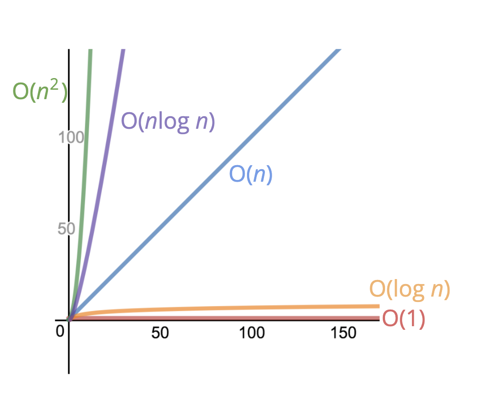

## 알고리즘

특정 문제를 해결하기 위한 일련의 과정을 알고리즘이라고 한다.

## 알고리즘의 평가 기준

같은 문제를 해결하는 수많은 알고리즘이 존재하는데 그 중에 더 나은 알고리즘이 무엇인지를 어떻게 판단할 수 있을까?
속도와 메모리 사용량을 기준으로 판단한다.

속도가 빠를수록, 메모리 사용량이 적을수록 성능이 더 좋은 알고리즘이다.

### 속도 측정법

알고리즘이 수행되는 동안의 물리적인 시간을 측정하면 오차가 발생하며 알고리즘을 분석하는데 도움이 되는 정보도 아니다.
알고리즘은 시간 대신 알고리즘이 수행하는 총 연산수를 속도의 기준으로 한다.

연산수는 오차가 생길 수 없고 알고리즘 분석을 통해 어느 부분에서 알고리즘의 성능이 나빠지는지 판단할 수 있는 기준이 된다.

### 메모리 사용량 측정법

알고리즘이 수행되는데 필요로하는 총 메모리 칸수를 기준으로 한다.

### 무한히 커지는 인풋

속도나 메모리 사용량이나 모두 인풋값이 큰 경우의 대략적인 경향성만 본다. 인풋을 극단적으로 크게 생각하면 경향성만 보더라도 충분히 알고리즘의 성능을 판단할 수 있다.

## 빅오 표기법

빅오 표기법은 알고리즘의 대략적인 연산 갯수를 표기하는 방법이며 입력의 크기와 실행시간 사이의 관계를 나타낸다.



빅오 표기법은 빅오만 보고 이 알고리즘의 성능이 어떤지를 파악할 수 있는 객관적인 표현이 된다.
빅오 표기법으로 표현된 속도, 메모리 사용량은 각각 시간복잡도, 공간복잡도라고 표현한다.

## 대표적인 연산

`삽입`, `제거`, `검색`, `접근`은 기억해두어 나중에 어떤 구조를 사용할 지 생각할 때 빅오 관점에서 어느것이 더 괜찮을지 판단하는 기준으로 삼자. 또한 언어에서 제공하는 연산들의 빅오는 알아두자.

## 문제 해결 전략

1. 문제 이해하기
   - 내 말로 이 문제를 다시 표현할 수 있는지?
   - 어떤 인풋과 어떤 아웃풋이 필요한지? 그 형태는 어떨지?
   - 충분한 정보가 주어졌는지? (미리 생각해보는 것만으로 도움된다)
   - 문제에서 중요한 데이터를 어떻게 네이밍하여 다룰지?
2. 구체적인 예시들 경험하기
   - 간단한 예시부터 시작하여 복잡한 예시까지 충분히 경험하기
   - 빈 인풋들이나 유효하지 않은 인풋이 들어온 경우를 생각하기
3. 수행할 단계를 명확히 하기
   - 실제 코드 작성전에 주석으로 로직 작성하기
4. 어려운 부분은 일단 문제를 단순화 시켜서 생각하기
   - 어려운 부분에서 진행이 안된다면 일단 문제를 단순화시켜 문제를 풀고 나중에 어려운 부분을 통합시킬 생각을 해야한다.
5. 문제 리뷰하며 리팩토링하기
   - 다른 방법은 없는지, 가독성은 어떤지, 성능은 어떤지 리뷰해보기

## 일반적인 문제해결 패턴

1. 빈도수 세기  
   객체나 집합을 이용하여 값이나 빈도수를 모두 파악해두는 방법

   ```js
   function same(arr1, arr2) {
     if (arr1.length !== arr2.length) {
       return false;
     }
     for (let i = 0; i < arr1.length; i++) {
       // 이 부분에서 필요할 때마 배열을 검색하여 O(n^2)이 된다.
       let correctIndex = arr2.indexOf(arr1[i] ** 2);
       if (correctIndex === -1) {
         return false;
       }
       arr2.splice(correctIndex, 1);
     }
     return true;
   }
   ```

   ```js
   function same(arr1, arr2) {
     if (arr1.length !== arr2.length) {
       return false;
     }
     // 미리 전체 순회를 통해 필요한 정보를 객체에 저장하여 전체 알고리즘이 O(n)이 되었다.
     let frequencyCounter1 = {};
     let frequencyCounter2 = {};
     for (let val of arr1) {
       frequencyCounter1[val] = (frequencyCounter1[val] || 0) + 1;
     }
     for (let val of arr2) {
       frequencyCounter2[val] = (frequencyCounter2[val] || 0) + 1;
     }
     for (let key in frequencyCounter1) {
       if (!(key ** 2 in frequencyCounter2)) {
         return false;
       }
       if (frequencyCounter2[key ** 2] !== frequencyCounter1[key]) {
         return false;
       }
     }
     return true;
   }
   ```

2. 다중 포인터  
   여러 포인터를 이용하여 포인터간 거리를 좁혀나가거나 함께 움직여 문제를 푸는데 활용하는 방법

   ```js
   // 값이 작은순으로 정렬되어 있는 arr
   function sumZero(arr) {
     for (let i = 0; i < arr.length; i++) {
       // 더해야보아야할 두 값을 찾을 인덱스로 인해 알고리즘이 O(n^2)이 되었다.
       for (let j = i + 1; j < arr.length; j++) {
         if (arr[i] + arr[j] === 0) {
           return [arr[i], arr[j]];
         }
       }
     }
   }
   ```

   ```js
   function sumZero(arr) {
     // 포인터를 두 개를 잡아 더해야할 값에 O(1)로 접근할 수 있게하여 알고리즘을 O(n)으로 만들었다.
     let left = 0;
     let right = arr.length - 1;
     while (left < right) {
       let sum = arr[left] + arr[right];
       if (sum === 0) {
         return [arr[left], arr[right]];
       } else if (sum > 0) {
         right--;
       } else {
         left++;
       }
     }
   }
   ```

3. 슬라이딩 윈도우  
   포인터나 배열과 같은 것을 이용하여 윈도우를 만들어내고 데이터셋을 조건에 따라 윈도우를 진행시켜 탐색하는 방법, 다중 포인터 패턴의 일부로 볼 수 있다.

   ```js
   function maxSubarraySum(arr, num) {
     if (num > arr.length) {
       return null;
     }
     var max = -Infinity;
     // 인덱스를 두개 사용하여 알고리즘이 O(n^2)이 되었다.
     for (let i = 0; i < arr.length - num + 1; i++) {
       temp = 0;
       for (let j = 0; j < num; j++) {
         temp += arr[i + j];
       }
       if (temp > max) {
         max = temp;
       }
     }
     return max;
   }
   ```

   ```js
   function maxSubarraySum(arr, num) {
     let maxSum = 0;
     let tempSum = 0;
     if (arr.length < num) return null;
     // 슬라이딩 윈도우는 그 범위를 대표하는 값이 있다.
     for (let i = 0; i < num; i++) {
       maxSum += arr[i];
     }
     // 슬라이딩 해가면서 윈도우를 대표하는 값을 루프 한번으로 업데이트할 수 있게되어 알고리즘이 O(n)이 되었다.
     tempSum = maxSum;
     for (let i = num; i < arr.length; i++) {
       tempSum = tempSum - arr[i - num] + arr[i];
       maxSum = Math.max(maxSum, tempSum);
     }
     return maxSum;
   }
   ```

4. 분할 정복  
   큰 문제를 작은 문제들로 나누어 작은 문제를 해결해나가며 큰 문제를 해결하는 방법

   ```js
   // 작은순으로 정렬된 arr
   function search(arr, val) {
     // 최악의 경우 전체 순회를 하여 알고리즘이 O(n)
     for (let i = 0; i < arr.length; i++) {
       if (arr[i] === val) {
         return i;
       }
     }
     return -1;
   }
   ```

   ```js
   function search(array, val) {
     let min = 0;
     let max = array.length - 1;

     while (min <= max) {
       let middle = Math.floor((min + max) / 2);
       let currentElement = array[middle];
       // 탐색이 필요없는 범위를 절반씩 제거해나가며 알고리즘을 O(logN)으로 만들었다.
       if (array[middle] < val) {
         min = middle + 1;
       } else if (array[middle] > val) {
         max = middle - 1;
       } else {
         return middle;
       }
     }
     return -1;
   }
   ```

### 결론

- 검색이 많이 필요하다면 미리 필요한 정보를 계산해두기
- 포인터
  - 계속 접근해야하는 값은 계산하려하지 말고 포인터 활용하기
  - 포인터들을 이용하여 범위를 어떻게 만들어야 할지 생각하기
- 범위를 유용하게 만들기 위해서는 값이 특정 기준으로 정렬되어 있어야한다.
- 문제를 하나의 큰 문제로 보지말고 더 작은 문제로 나누어 해결할 수 있는지 생각하기
- 순수하게 구현을 통해서 문제를 풀면 O(>=n^2)를 향하는 코드를 O(n) 이하로 낮추는 것이 핵심
